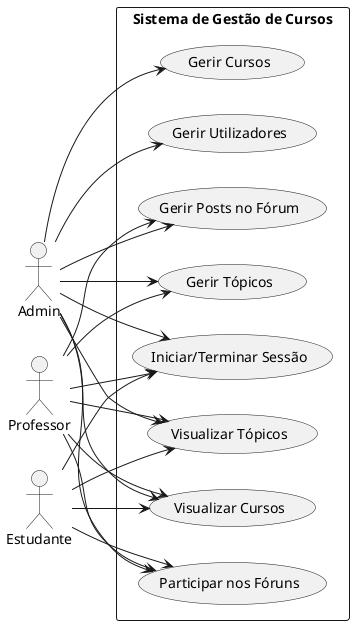

# Diagrama de Casos de Uso

### Descrição dos Casos de Uso

1. **Iniciar/Terminar Sessão (UC1)**
   
   - **Descrição**: Permite que o utilizador inicie e termine sessão no sistema.
   - **Atores**: Admin, Professor, Estudante

2. **Gerir Cursos (UC2)**
   
   - **Descrição**: Permite que o administrador crie, edite e elimine cursos.
   - **Atores**: Admin

3. **Visualizar Cursos (UC3)**
   
   - **Descrição**: Permite que os utilizadores visualizem a lista de cursos disponíveis.
   - **Atores**: Admin, Professor, Estudante

4. **Gerir Tópicos (UC4)**
   
   - **Descrição**: Permite que o administrador e o professor criem, editem e eliminem tópicos.
   - **Atores**: Admin, Professor

5. **Visualizar Tópicos (UC5)**
   
   - **Descrição**: Permite que os utilizadores visualizem os tópicos disponíveis em um curso.
   - **Atores**: Admin, Professor, Estudante

6. **Participar nos Fóruns (UC6)**
   
   - **Descrição**: Permite que os utilizadores criem posts nos fóruns.
   - **Atores**: Admin, Professor, Estudante

7. **Gerir Posts no Fórum (UC7)**
   
   - **Descrição**: Permite que o administrador e o professor eliminem posts no fórum.
   - **Atores**: Admin, Professor

8. **Gerir Utilizadores (UC8)**
   
   - **Descrição**: Permite que o administrador crie, edite e elimine utilizadores do sistema.
   - **Atores**: Admin

