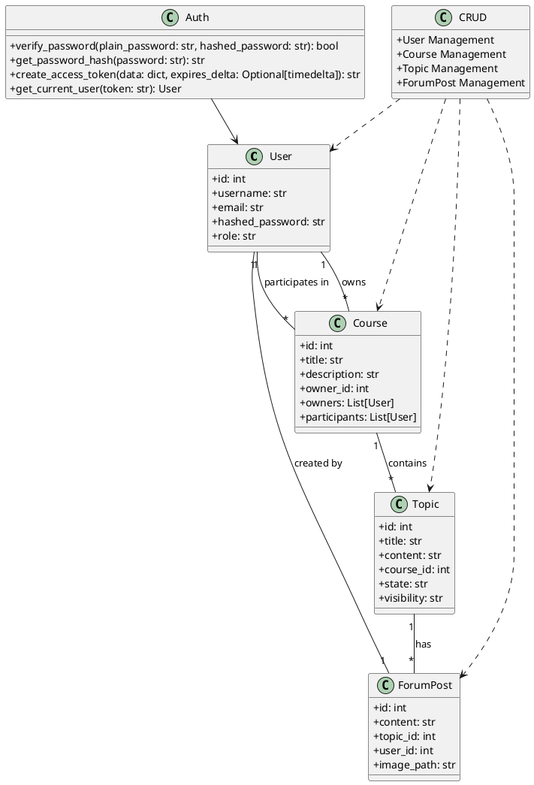

# Diagrama de Classes

#### Descrição das Classes Principais

##### 1. User

A classe `User` representa um utilizador da aplicação. Os principais atributos incluem:

- `id`: Identificador único do utilizador.
- `username`: Nome de utilizador.
- `email`: Endereço de email do utilizador.
- `hashed_password`: Palavra-passe encriptada do utilizador.
- `role`: Papel do utilizador na aplicação, que pode ser "admin", "teacher" ou "student".

##### 2. Course

A classe `Course` representa um curso na plataforma. Os principais atributos incluem:

- `id`: Identificador único do curso.
- `title`: Título do curso.
- `description`: Descrição do curso.
- `owner_id`: Identificador do dono do curso.
- `owners`: Lista de utilizadores que são donos do curso.
- `participants`: Lista de utilizadores que participam do curso.

##### 3. Topic

A classe `Topic` representa um tópico dentro de um curso. Os principais atributos incluem:

- `id`: Identificador único do tópico.
- `title`: Título do tópico.
- `content`: Conteúdo do tópico.
- `course_id`: Identificador do curso ao qual o tópico pertence.
- `state`: Estado do tópico (ex. "draft", "published").
- `visibility`: Visibilidade do tópico (ex. "public", "private").

##### 4. ForumPost

A classe `ForumPost` representa uma postagem no fórum de um tópico. Os principais atributos incluem:

- `id`: Identificador único da postagem.
- `content`: Conteúdo da postagem.
- `topic_id`: Identificador do tópico ao qual a postagem pertence.
- `user_id`: Identificador do utilizador que criou a postagem.
- `image_path`: Caminho para a imagem anexada à postagem.

##### 5. Auth

A classe `Auth` trata da autenticação e autorização dos utilizadores. Os principais métodos incluem:

- `verify_password`: Verifica se a palavra-passe corresponde ao hash armazenado.
- `get_password_hash`: Gera um hash para a palavra-passe fornecida.
- `create_access_token`: Cria um token de acesso JWT.
- `get_current_user`: Obtém o utilizador atual com base no token JWT.

##### 6. CRUD

A classe `CRUD` é responsável pelas operações de criação, leitura, atualização e eliminação (Create, Read, Update, Delete) de várias entidades. Está dividida em quatro categorias principais:

- **User Management**: Métodos para gerir utilizadores, como `get_user`, `create_user`, `update_user` e `delete_user`.
- **Course Management**: Métodos para gerir cursos, como `get_course`, `create_course`, `update_course` e `delete_course`.
- **Topic Management**: Métodos para gerir tópicos, como `get_topic`, `create_topic`, `update_topic` e `delete_topic`.
- **ForumPost Management**: Métodos para gerir postagens no fórum, como `get_forum_posts`, `create_forum_post` e `delete_forum_post`.

#### Relações Entre as Classes

- **Associação**:
  
  - Um `User` pode ser dono de muitos `Course` (`owns`).
  - Um `User` pode participar em muitos `Course` (`participates in`).
  - Um `Course` contém muitos `Topic`.
  - Um `Topic` tem muitas `ForumPost`.
  - Um `ForumPost` é criado por um `User`.

- **Dependência**:
  
  - A classe `CRUD` depende das classes `User`, `Course`, `Topic` e `ForumPost` para realizar operações de gestão.
  - A classe `Auth` depende da classe `User` para realizar operações de autenticação e autorização.
