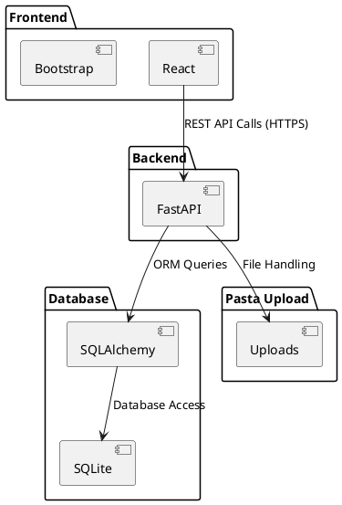

# Diagrama de Componentes

#### Descrição dos Componentes

- **Frontend (React, Bootstrap)**:
  
  - Utiliza React para criar a interface do utilizador.
  - Utiliza Bootstrap para o design responsivo e estilização.
  - Faz chamadas à API REST do backend para operações CRUD.

- **Backend (FastAPI)**:
  
  - Implementa a lógica do negócio e as regras de autenticação/autorização.
  - Exponibiliza endpoints RESTful para o frontend interagir com a aplicação.
  - Gere a autenticação utilizando tokens JWT.

- **Database (SQLAlchemy / SQLite)**:
  
  - SQLAlchemy é utilizado como ORM (Object-Relational Mapping) para interagir com o banco de dados.
  - SQLite é utilizado como banco de dados relacional para armazenar dados persistentes.

- **Pasta Upload (Uploads)**:
  
  - Localizacao dos uploads de ficheiros, como imagens associadas às postagens do fórum.

