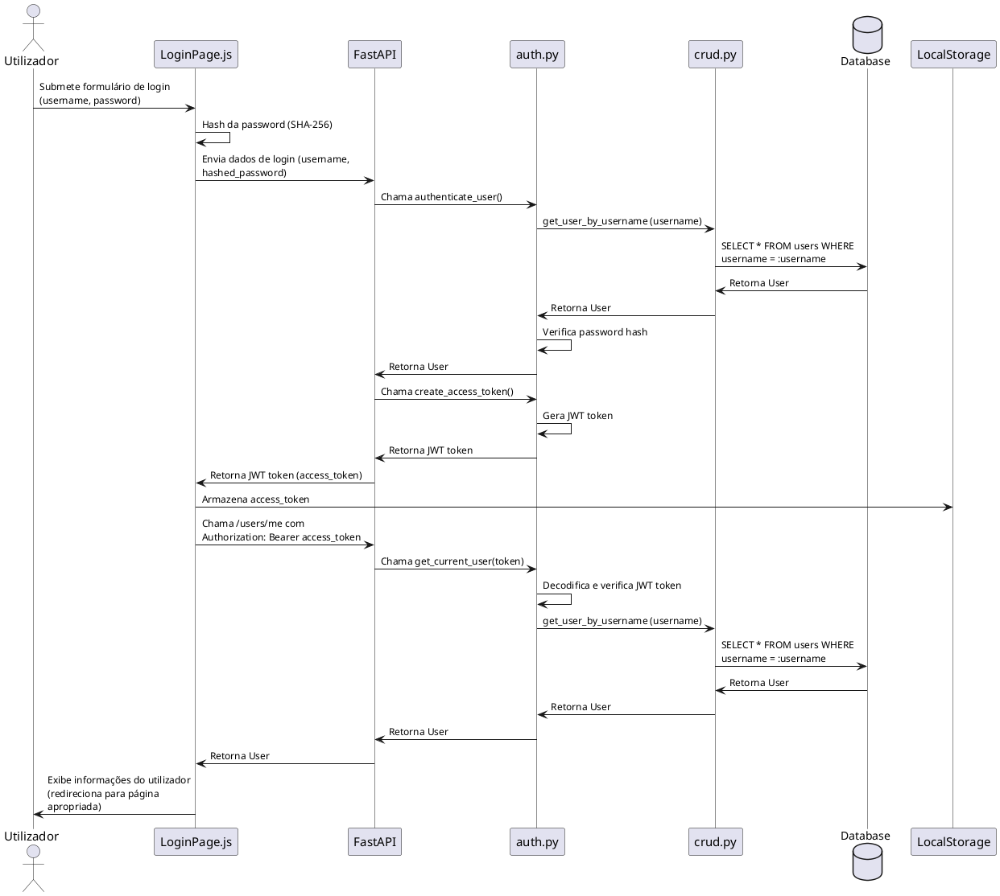
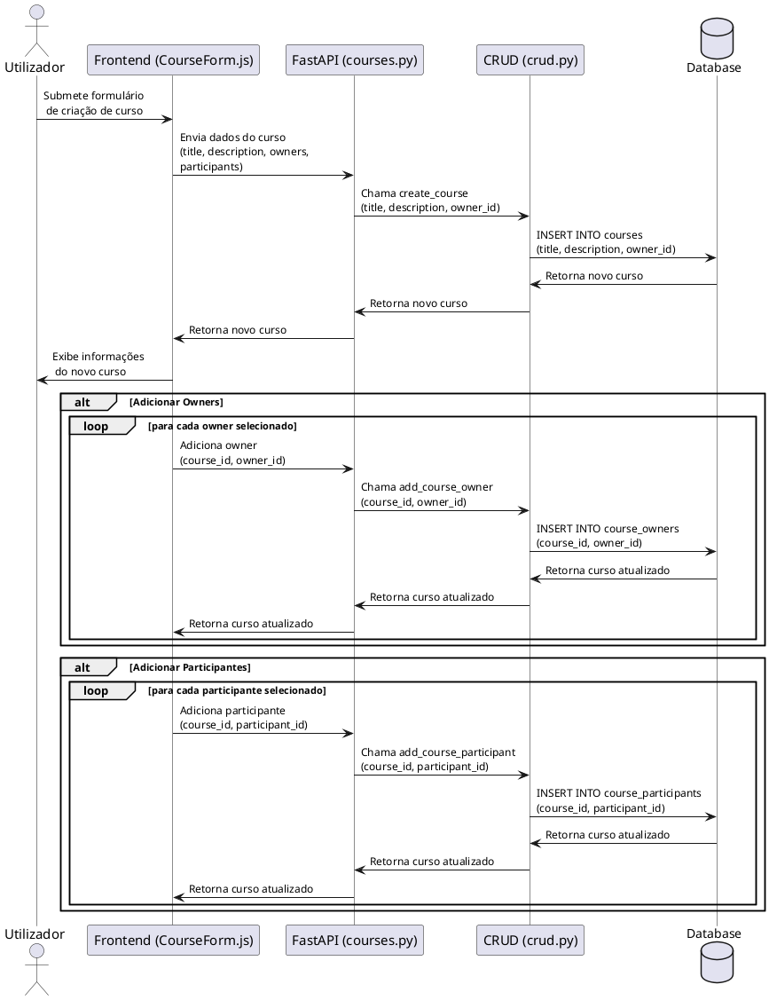
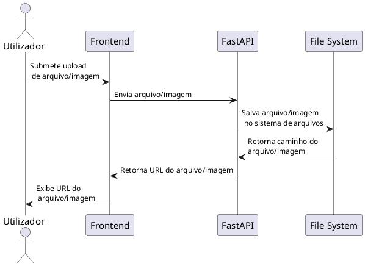
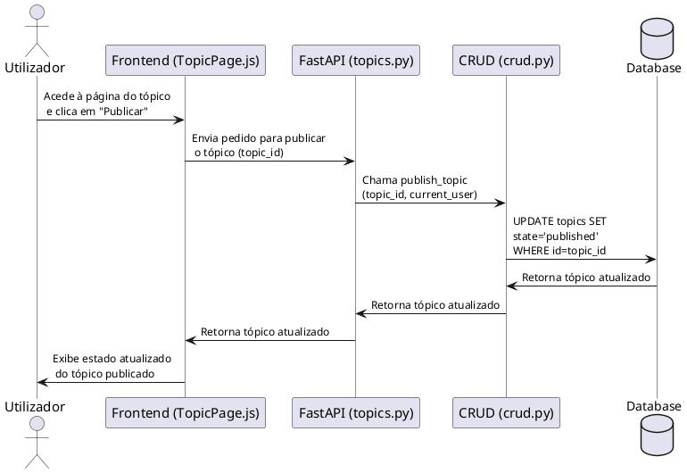
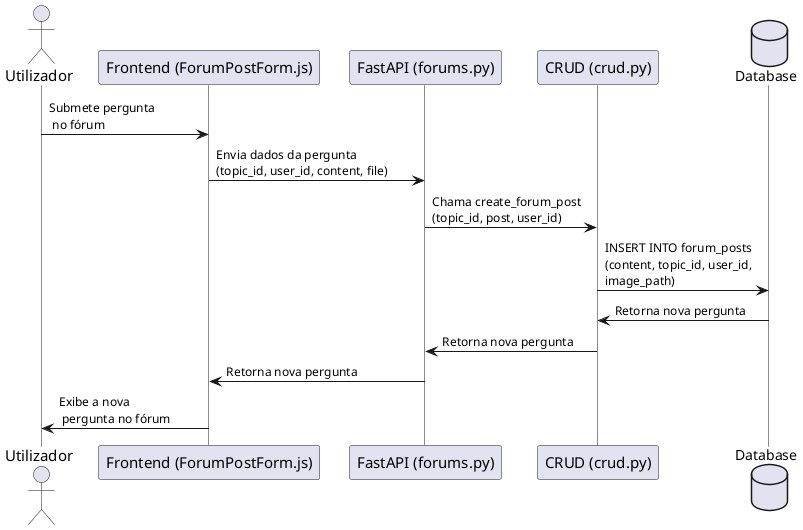

# Diagramas de Sequência

## Diagrama de Sequência: Processo de Autenticação

### Diagrama de Sequência: Criação de Curso

### Diagrama de Sequência: Post Forum e Upload de Arquivo/Imagem

### Diagrama de Sequência: Publicação de Tópico

### Diagrama de Sequência: Envio de Pergunta no Fórum

### Diagrama de Sequência: Upload de Arquivo/Imagem

